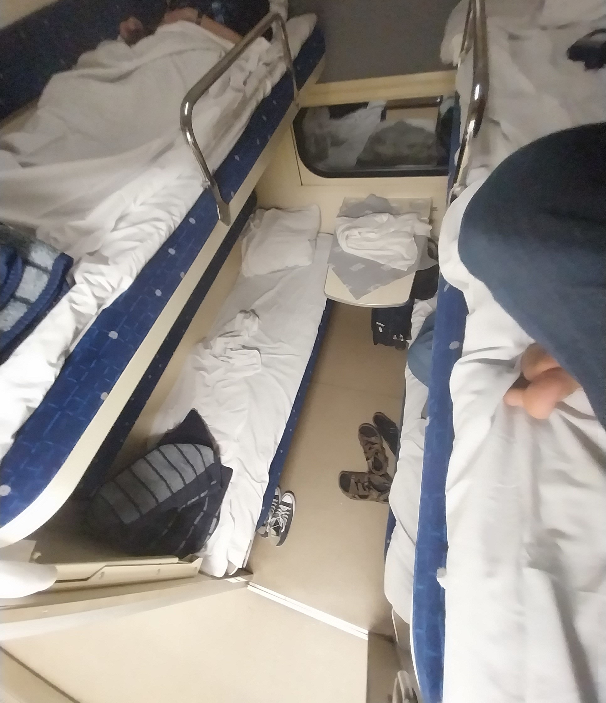
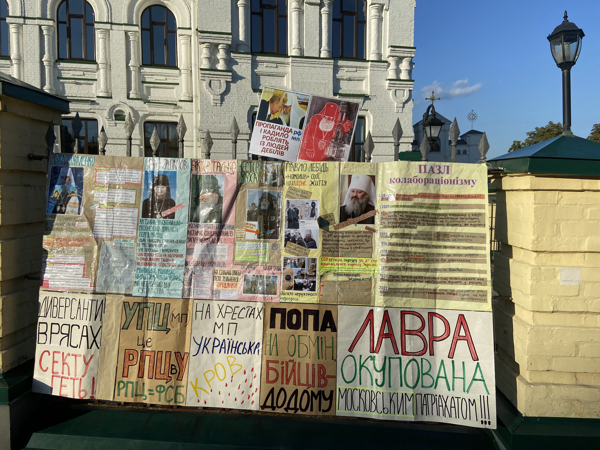

# Kyiv

## Le train couchette

Après quelques jours à Lviv, nous prenons le train de nuit pour Kyiv. C'est
quelque chose que l'on avait déjà fait en 2021, et c'est une expérience très
réconfortante.

Notre train part à 23h. Le quai n'est pas surélévé, il faut donc grimper trois 
marches étroites, et y hisser les valises. On est alors accueilli par un
intérieur fraichement peint en beige. On accède aux cabines par un couloir
étroit qui longe le coté gauche du train. Comme on est en seconde classe, il y
quatre lits par cabine, superposés par deux de chaque côté de la fenêtre. Tout
est flambant neuf et il y a même des petits voyants lumineux pour indiquer si
les toilettes sont libres.

On fait les lits puis on se couche l'un au-dessus de l'autre. Le bruit et le
roulis du train nous bercent doucement, et chaque kachlong est un rail en moins
qui nous sépare de Kyiv. Nous sommes réveillés à 5h30 par l'hôte de la rame qui
amène du thé à ceux qui en ont commandé. On regarde l'Ukraine défiler pendant
une demi-heure avant de descendre du train, à Kyiv.

## La ville

On retrouve la même ville qu'en 2021, mais beaucoup de choses ont changé.
L'immense statue de la mère patrie, installée sur une colline surplombant la ville
et le fleuve, est en train de se faire retirer le marteau et la faucille qui
ornaient son bouclier. Le symbole sera remplacé par le trident national quelques
jours plus tard. On ne peut plus visiter le musée à son pied, ce qui est
vraiment dommage car il contenait en 2021 deux expositions : une sur la guerre
dans le Donbass depuis 2014, plutôt moderne, et une autre soviétique, très
propagandesque sur la Seconde Guerre Mondiale.

Il a toutefois un plus petit musée, avec une exposition sur l'invasion de 2022.
Un certain nombre d'objets récupérés sur des soldats russes morts sont
présentés. Le passeport d'un très jeune citoyen de la soi-disante "République
Populaire de Louhansk" m'a particulièrement marqué. Cet Etat-poupée séparatiste
installé par la Russie est connu pour sa mobilisation particulièrement
agressive. Leur troupes, très mals équipées et entrainées,
sont utilisées comme chair à canon moins coûteuse politiquement que des citoyens
russes.

Sur la même colline, il y a la Laure des Grottes, un grand monastère où sont
enterrés dans des tunnels des corps de saints de l'église orthodoxe. Les corps
sont conservés par les minéraux présents naturellement dans les tunnels, et on
peut même les visiter, ce qu'on avait fait en 2021. Cette fois-ci, nous n'irons
pas, car la Laure est encore controlée par le patriarcat de Moscou. Nous ne
sommes pas les seuls de cet avis : lorsque l'on passe devant il y a une petite
manifestation. Des affiches sont sur le grillage extérieur, et un type
interpelle les prêtres à l'aide d'un haut-parleur.

Pas très loin d'ici, on prend un café dans un hotel célèbre pour son
architecture. La photo que j'ai prise montre en arrière-plan un complexe résidentiel
monstrueux, une sorte de McBuilding typique du développement urbain sauvage qui
a lieu en Ukraine

Sur la place de l'Indépendance, dite "Maïdan", lieu de la révolution de la
dignité de 2014, il y a beaucoup d'installations liées à la guerre. Il y
a un parterre de petits drapeaux, chaque drapeau commémorant un soldat tombé.
Des hérissons anti-char ont été peints. Le musée de la méduse et le centre
commercial sous-terrain Globousse sont encore présents. 

## Les alertes

À Kyiv, on dort chez l'oncle d'Antonina, Serge. Son appartement est dans une
_khruvtchevka_, un immeuble de l'époque de Khroutchev. Ce sont des immeubles d'une
dizaine d'étages, ce qui est peu à Kyiv, mais assez longs. Ils sont souvent dans
un état plutot mauvais. Chaque appartement dispose d'un voire deux balcons,
construits ouverts, mais tous munis de fenêtres ajoutées par les résidents,
avec du bois. Ces immeubles ont un ascenceur étroit, qui montre son âge par
toute sortes de bruits menacants. Il y a souvent un jardin à leur pied, muni
d'une aire de jeux pour enfant. À l'exterieur, des escaliers recouverts d'un toit
en tôle mènent à un sous-sol peu engageant, dont le sol est en terre battue.

Lorsqu'il y a une alerte aérienne, on entend en premier la sonnerie de
l'application prévue à cet effet, puis des sirènes, les mêmes que les premiers
mercredis du mois en France. Lors de notre première nuit à Kyiv, Serge nous
indique qu'il les ignore. On marche quand même cinq minutes pour se réfugier dans
le métro, mais les allées et venues nous donnent l'impression que l'attitude de
Serge est largement partagée. Il y aura une deuxième alerte dans la même
journée, que l'on ignorera. Le début d'une sirène ressemble beaucoup au bruit
d'une voiture qui accélère au loin, et il arrive souvent qu'on les confonde
pendant quelques secondes.

Antonina est abonnée à un canal Telegram qui donne des informations plus
précises sur les alertes. La plupart du temps il s'agit d'un bombardier russe
qui a decollé. Il ne lance pas de missile à chaque fois, et ces missiles
ayant une très grande portée, cela déclenche une alerte dans toute l'Ukraine.

Lors de notre deuxième nuit, on est reveillés à 1h30 par une alerte. Telegram
indique qu'il s'agit de Shaheds, des drones iraniens, lents et petit, mais ayant
une grande portée et un coût très faible. On hésite un peu avant de se
recoucher. Quinze minutes plus tard, on est de nouveau réveillés, cette fois par
des explosions. Serge ne sort pas de sa chambre, et on convient avec Timothée,
son fils de 10 ans, de descendre se cacher. On juge le sous-sol trop
inconfortable et on prend la direction du métro, ce qui était une franchement
mauvaise idée puisque les explosions continuent pendant notre trajet et qu'on
aperçoit même une sorte de boule de feu traverser l'horizon. On arrive au métro
où il y a cette fois beaucoup de monde. Les plus habitués ont des matelas et des
chaises de camping. On attend une heure et demi la fin de l'alerte sur le quai.

On apprendra par la suite que tous les Shaheds ont été abattus, et que les
débris n'ont touché personne. C'était la pire nuit à Kyiv depuis deux mois,
mais ce n'était rien par rapport au quotidien pendant l'hiver. On nous dira
aussi que Kyiv est désormais protégée contre les missiles, grâce aux défenses
anti-aériennes fournies par l'Occident, mais que c'est la seule ville d'Ukraine
dans ce cas. On prendra aussi l'habitude de descendre au métro lors des alertes
de Shaheds, sans attendre qu'ils soient là.

