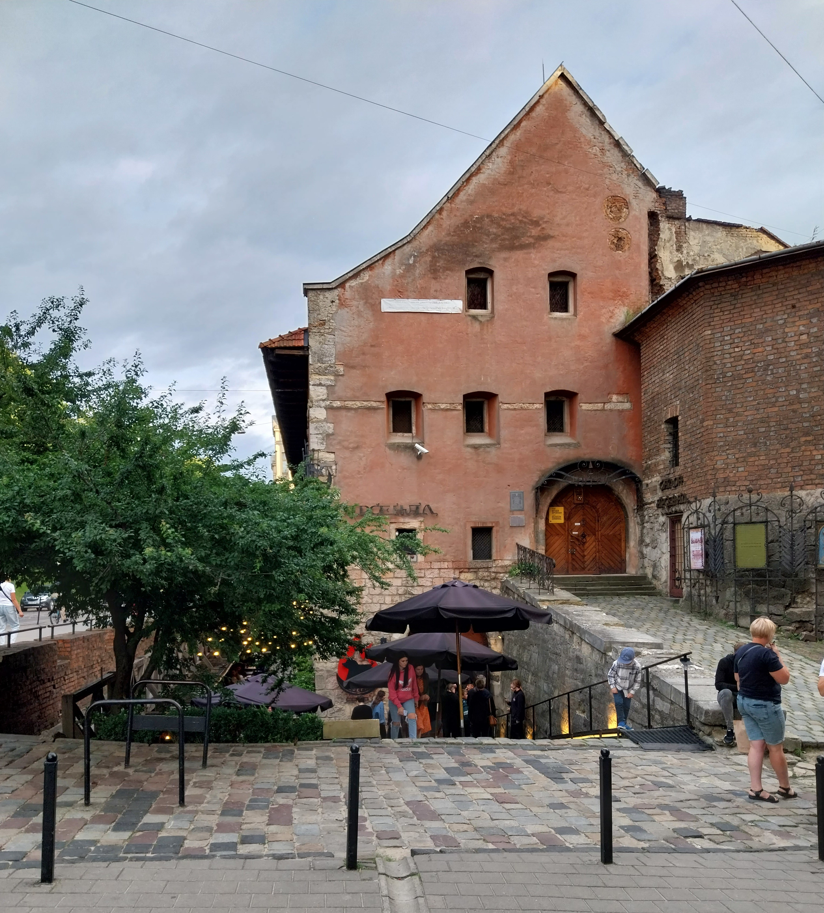
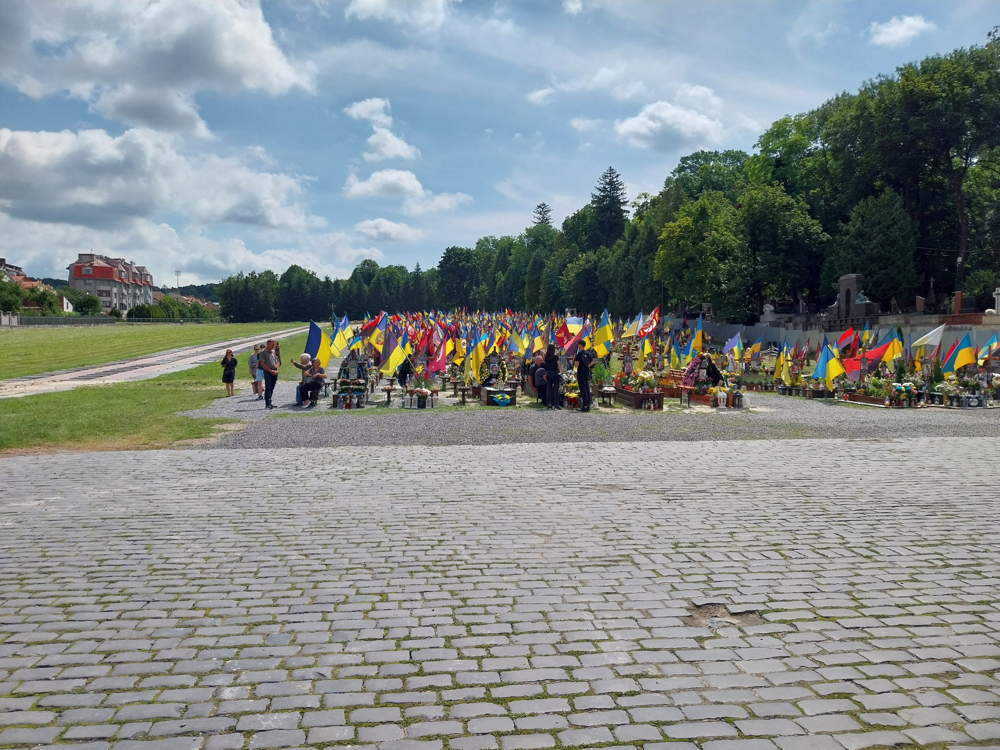

## Lviv

### Superhumans

L'hôtel où je me rendais n'était pas en centre-ville car il se situe près d'un
centre médical nommé Superhumans, avec lequel ma compagne Antonina organise une
collaboration au nom du ministère de la Santé. Elle s'y est rendue pour
accompagner pendant une semaine des chirurgiens et prothésistes français.
L'hôtel est un grand bâtiment, qui domine les maisons et petits immeubles
présents autour. Il est très moderne, et tout y est écrit en anglais. Un
restaurant très classe partage le même bâtiment. 

L'hôtel en question.

Vue de l'hôtel.

Le lendemain de mon arrivée, la réception de clôture du voyage à lieu dans ce
restaurant. Je rencontre les médecins, les Français sont très sympathiques, la
communication est un peu plus compliquée avec les Ukrainiens. Le directeur
médical du centre Superhumans est un grand type assez maigre, qui parle très
bien anglais. Il porte sous sa veste de costume un t-shirt avec un Renault master
imprimé. Je l'interroge, et il m'explique que c'est son fils qui le lui a acheté
car il conduisait ce camion pour acheminer des fournitures humanitaires et
militaires dans la région de Kherson. Il me montre les photo d'une fois où ils
ont dû rebrousser chemin car la route était minée. Je ne peux m'empecher de
mentionner que j'ai conduit le même véhicule pour un démanagement 10 jours avant
mon départ. C'est un très bon camion, et j'avais été assez stressé par la
conduite d'un si gros véhicule dans les rues parisiennes étroites néanmoins dénuées de mine.

### Le tourisme

Une fois les médecins français rentrés en France, nous changeons d'hôtel pour nous
rapprocher du centre ville, qui a très peu changé depuis notre visite de 2021.
On retrouve les même restaurants, la même ambiance de grande zone dédiée au
tourisme, un grand nombre de magasins de souvenirs. Les souvenirs ont changé,
beaucoup sont des références à la guerre. Chaque boutique affiche son drapeau,
et elles sont nombreuses à avoir une urne pour collecter des dons pour les
forces armées. 

Les églises affichent aussi leur soutien à l'armée.

L'arsenal de Lviv. Il y a un musée à l'étage, et un grand restaurant au sous-sol.

Ci-dessus, on peut voir la carte de l'alerte aérienne en cours. Nous ne sommes
pas inquiets car le restaurant est au sous-sol de l'arsenal, et les murs sont
épais.

###  L'enterrement d'un soldat

La mère d'Antonina lui avait dit qu'un membre de la famille est enterré dans le
grand cimetière de la ville. C'est une sorte de petit Père-Lachaise, il y a
beaucoup d'arbres et de grandes tombes. Il faut prendre un ticket pour entrer,
et c'est une visite que l'on avait déjà faite en 2021.

On y retourne pour voir essayer de trouver la tombe de l'ancêtre, et voir ce qui
a changé. En arrivant on choisit de visiter en premier l'extension reservée aux
morts de la guerre. C'est à l'extérieur de l'enceinte du vieux cimetière. Il y a
en premier lieu une sorte d'estrade en béton accolé au mur gris. Au dessus de
celle-ci est suspendu un grand trident ukranien doré, et il y a un mât avec un
drapeau juste à coté. Autour de l'estrade, le sol est pavé. Plus loin il y a un
pré, qui monte légérement, et dans lequel les tombes sont creusées. Une allée
centrale recouverte de gravier divise les rangs de six tombes. Les tombes sont
en bois, elles montent à hauteur de genous, et n'ont pas de couvercle ; elles
sont remplies de terre et recouvertes de fleurs. Il y a une croix au bout, avec
une photo accrochée. Derrière la croix se trouve une grande couronne de fleurs,
et sur ses flancs plusieurs drapeaux, qui d'en bas forment une forêt. Des petits
bancs sont placés entre les tombes, et servent à beaucoup de familles qui sont
venues entretenir la tombe et se recueillir, à l'occasion du week-end.

Au moment où nous partons, plusieurs voitures et un bus arrivent, pour
enterrer un soldat. Six soldats portent le cercueil sur l'estrade, un drapeau
est déplié sur celui-ci, et un prêtre chante une longue prière. Lorsqu'elle est
finie, d'autres soldats tirent trois coups de leur fusil. 

Le drapeau est replié et le cercueil est récuperé par les six hommes qui le
portent le long de l'allée centrale. La famille du mort suit le cercueil, et sur
son chemin, de nombreuses personnes mettent un genou à terre. Une fois le
cercueil trop haut pour qu'on le voit, nous partons pour rentrer dans le vieux
cimetière. On ne parviendra pas à trouver la tombe que l'on cherchait.

[Article suivant : Kyiv](kyiv.md)
